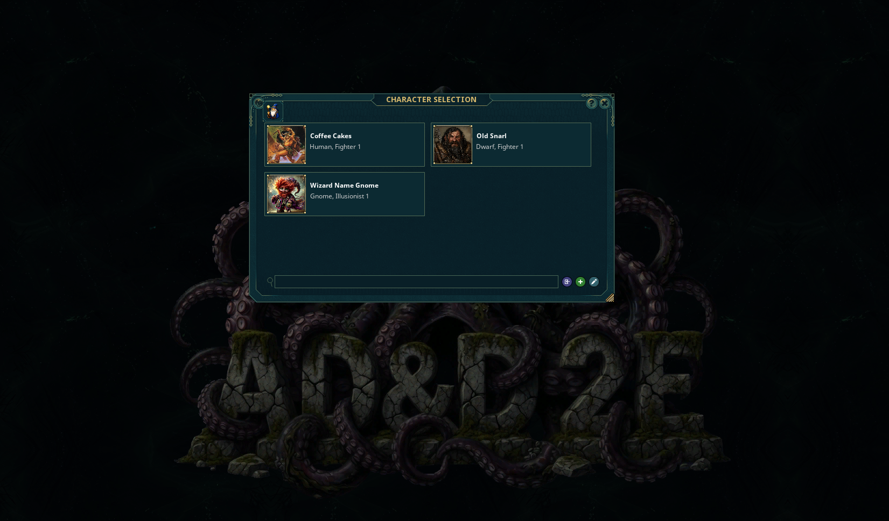
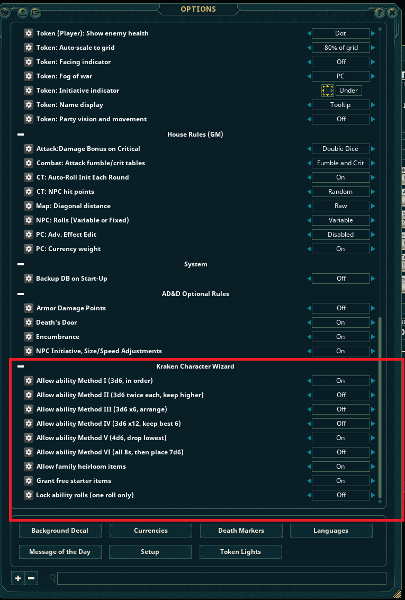
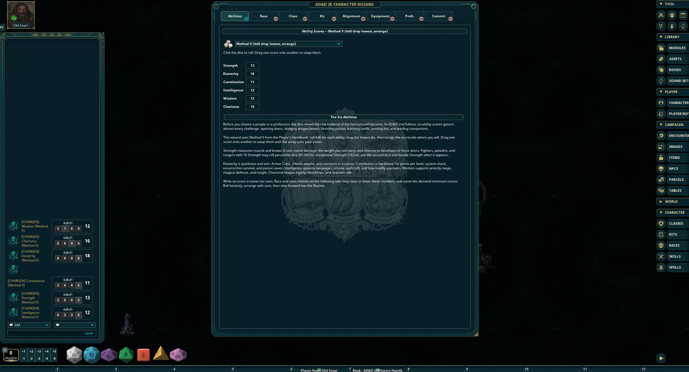
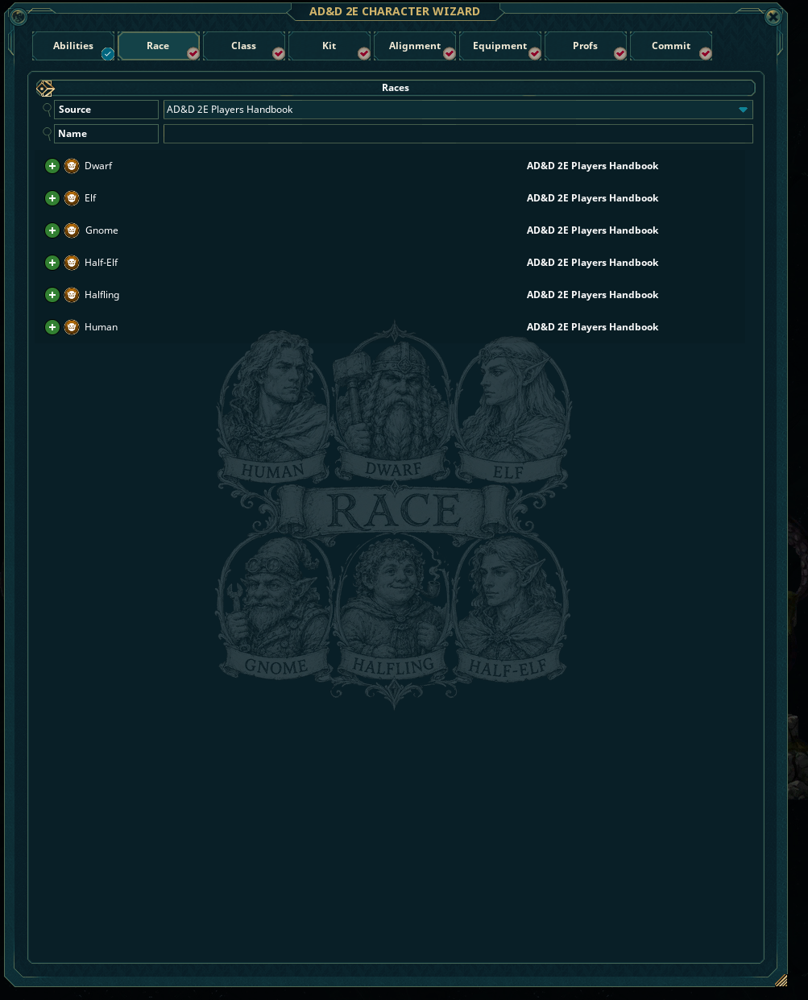
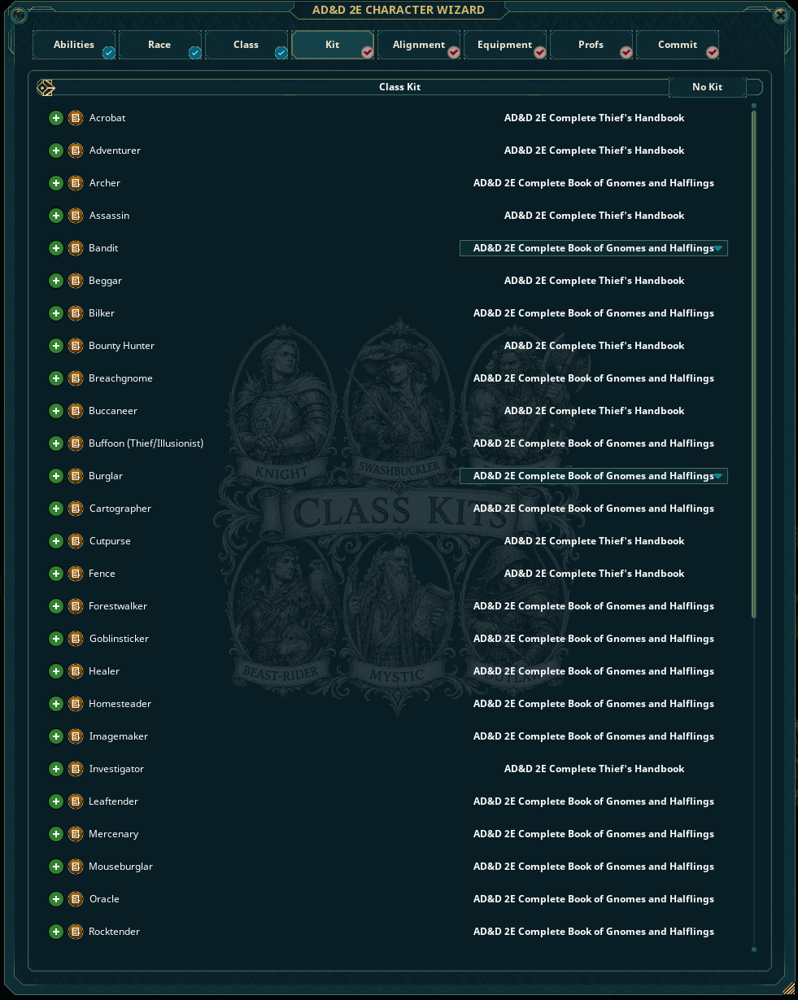
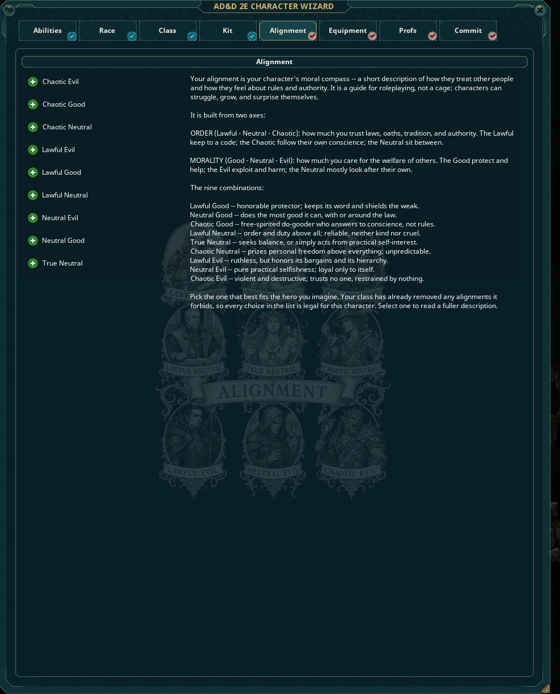
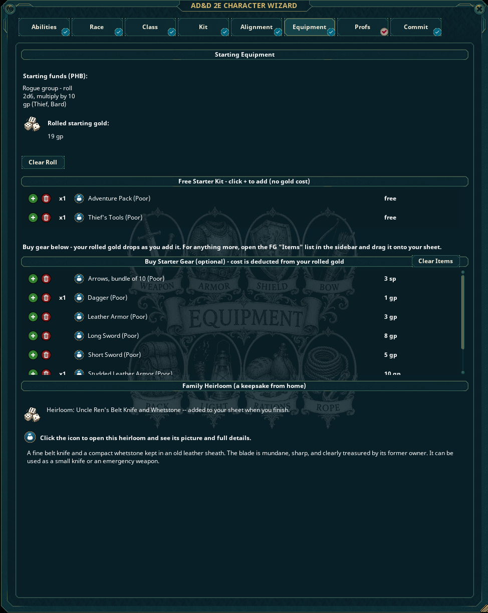
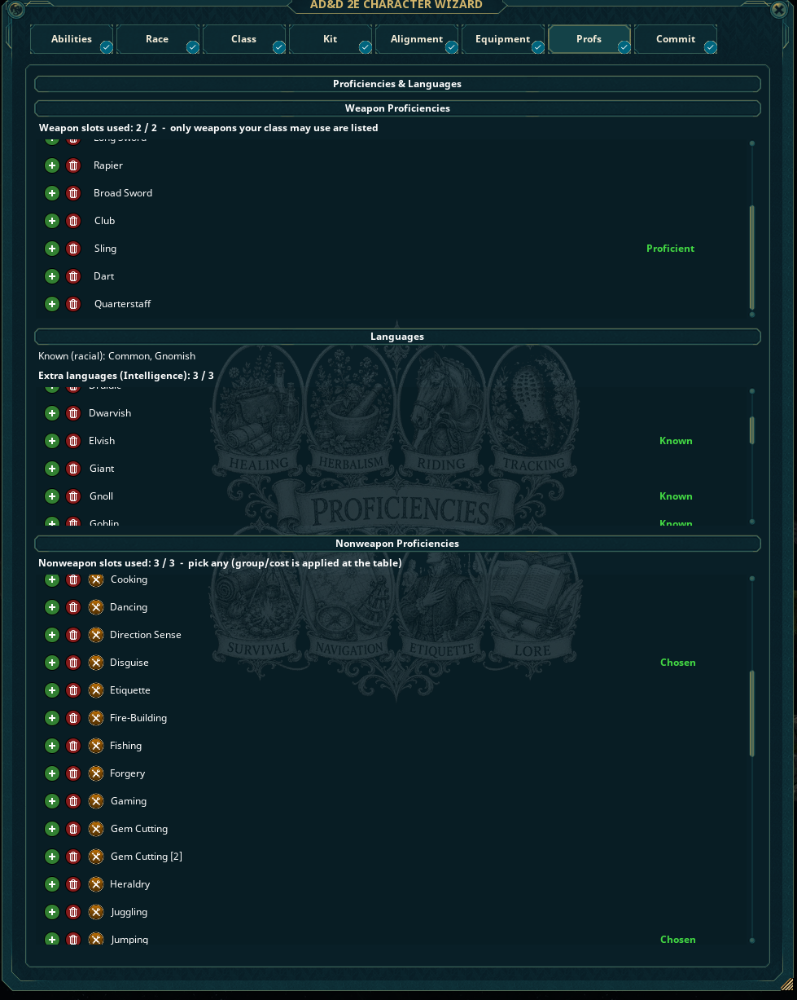
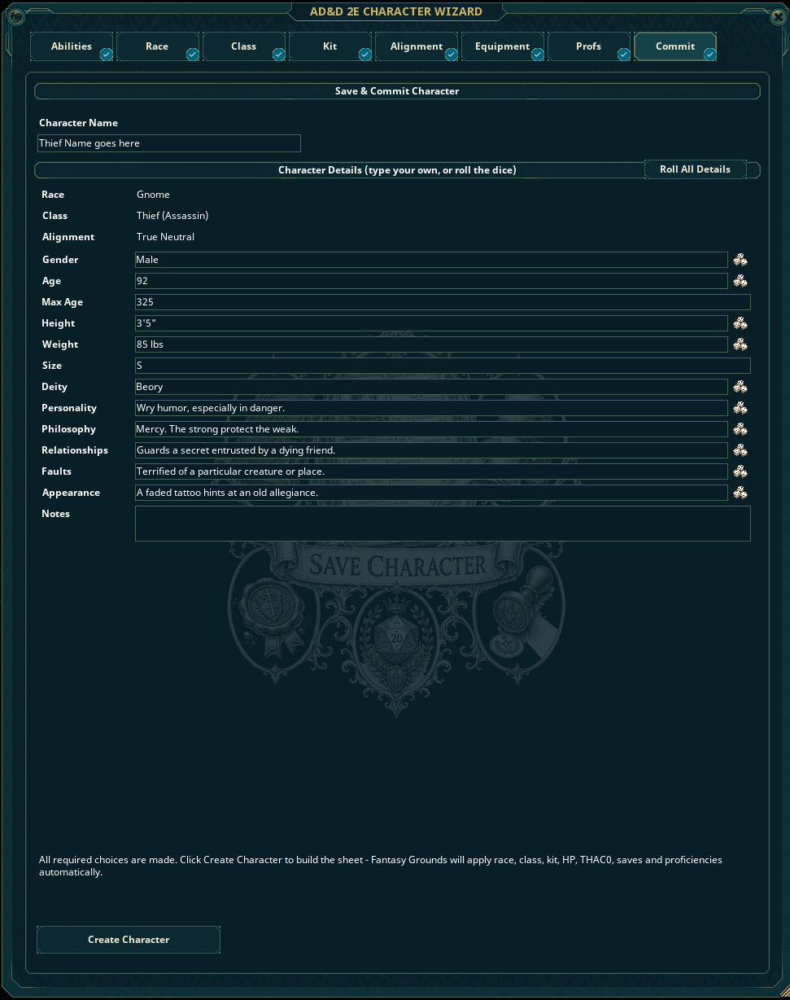
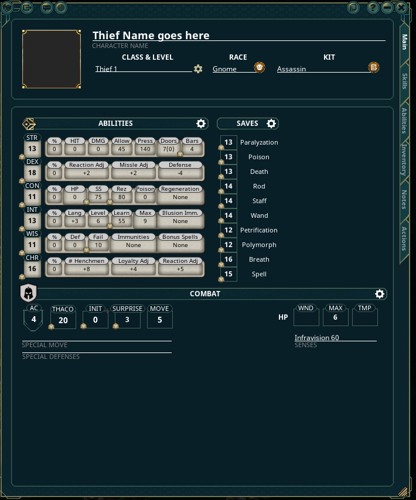

# Install & User Guide

Everything you need to install the **Kraken AD&D 2E Character Wizard**, know what each file is, where it goes, and how to use the wizard.

> 🎥 **Prefer to watch?** See the [video walkthrough on YouTube](https://youtu.be/DUrpYcwq9xY).

---

## 1. What's in the download

From the [latest Release](../../releases/latest) you get two files:

| File | What it is | Where it goes |
|------|------------|---------------|
| **`KrakenCharWizard2E.ext`** | The extension — the character-creation wizard itself | your Fantasy Grounds **`extensions\`** folder |
| **`The Drowned Archive.mod`** | Companion module — the "(Poor)" starter gear, family heirlooms, and the Adventure Pack the wizard hands out | your Fantasy Grounds **`modules\`** folder |

> GitHub may show the module as `The.Drowned.Archive.mod` (it swaps spaces for dots). That's fine — Fantasy Grounds reads the module's real name from inside the file, so it loads correctly either way. No need to rename it.

---

## 2. Where to put the files

Your Fantasy Grounds **data folder** is usually:

```
%appdata%\SmiteWorks\Fantasy Grounds
```

(Paste that into the Windows Explorer address bar, or click the **folder icon** on the Fantasy Grounds launcher screen.)

Drop the two files in like this:

```
Fantasy Grounds\                      <- your data folder
├── extensions\
│   └── KrakenCharWizard2E.ext        <- the extension goes here
└── modules\
    └── The Drowned Archive.mod       <- the module goes here
```

That's it — no unzipping, no subfolders.

---

## 3. What you must already own

These are commercial SmiteWorks products and are **not** included — you need them loaded for the wizard to work:

- **Fantasy Grounds Unity**
- **The AD&D 2E ruleset**
- **The 2E Player's Handbook module** — the wizard reads **races, classes, kits, spells, and nonweapon proficiencies** from it. Without it, those lists will be empty.

(Have any other 2E source modules — Complete Handbooks, etc. — active too, and their kits/proficiencies show up automatically.)

---

## 4. Turn it on

1. Launch Fantasy Grounds and load a **2E campaign as the GM/host**.
2. On the campaign **load screen**, click **Extensions** and tick **Kraken AD&D 2E Character Wizard**.
3. Once in the game, open **Library → Modules** and activate **The Drowned Archive** (and your Player's Handbook, if not already on).
4. Open the **Characters** list — there's a wizard button to launch it.



---

## 5. DM Options (GM controls)

Open **Options** (the gear / settings menu). Under **Kraken Character Wizard** you control what players may do:



- **Allow ability Method I–VI** — turn each PHB ability-score method on or off. Only the ones you allow appear in the player's dropdown.
- **Allow family heirloom items** — lets players roll a random keepsake on the Equipment tab.
- **Grant free starter items** — gives each character a class kit + an Adventure Pack at no gold cost.
- **Lock ability rolls (one roll only)** — players get a single roll, no re-rolling.

---

## 6. Build a character — tab by tab

The wizard runs left to right. Each tab gets a ✓ when its required choices are made.

### Abilities
Pick a generation method from the dropdown (only the methods your DM allowed are listed), then roll. Some methods let you **roll each attribute individually** (the dice icons) or **drag scores to arrange** them; the panel on the right explains the selected method.



### Race
Choose from the core races. Use the **Source** and **Name** filters to narrow the list, and click the shield to open the full library record.



### Class
Pick your class (the list is filtered to what your race may be) and set your **starting level**. Class drives your THAC0, saves, hit dice, and proficiency slots.

### Kit
Optional. Kits are filtered to your class/race; pick one or choose **No Kit**.



### Alignment
Pick from the nine alignments — the primer on the right explains the two axes while you decide. Choices your class forbids are blocked.



### Equipment
Your **starting gold** is rolled by class group. Then:
- **Free Starter Kit** — add your class kit + Adventure Pack at no cost.
- **Buy Starter Gear** — optional; the cost is deducted from your rolled gold as you add items. For anything else, drag from the FG **Items** list onto your sheet later.
- **Family Heirloom** — if your DM enabled it, roll a keepsake; click the icon to read its full details.



> The "(Poor)" gear is intentionally **one step worse** than standard equipment (and can fail under pressure) — cheap to start with, worth upgrading.

### Proficiencies
Spend your slots:
- **Weapon Proficiencies** — only weapons your class may use are listed; spending a slot here makes that weapon proficient (no non-proficiency penalty).
- **Languages** — your racial languages are shown as known; spend your Intelligence bonus on extras.
- **Nonweapon Proficiencies** — pick any; a `[2]` after a name means it costs **2** slots.



### Commit
Name the character and fill in the details — type your own or click a dice icon to roll one (or **Roll All Details**). When every required choice is made, click **Create Character**.



---

## 7. The finished sheet

Click **Create Character** and the wizard builds a complete 2E sheet — abilities (with derived stats), saves, **AC**, THAC0, HP, race traits, kit, proficiencies, languages, gold split into coins, and all your gear:



---

## 8. Troubleshooting

| Symptom | Likely cause / fix |
|--------|--------------------|
| No wizard button | Extension not enabled on the load screen, or you're not loaded as GM/host. |
| Race / Class / Spell / Proficiency lists are empty | The 2E **Player's Handbook** module isn't active (or isn't owned). |
| No "(Poor)" gear, heirlooms, or Adventure Pack | **The Drowned Archive** module isn't active. |
| An older character looks wrong (AC, coins, etc.) | Fixes apply when a character is **created** — build a fresh one; the wizard doesn't retro-edit existing sheets. |

---

## 9. Updating later

When a new [Release](../../releases/latest) comes out, just replace the two files in `extensions\` and `modules\` with the new versions (same filenames) and restart Fantasy Grounds.
